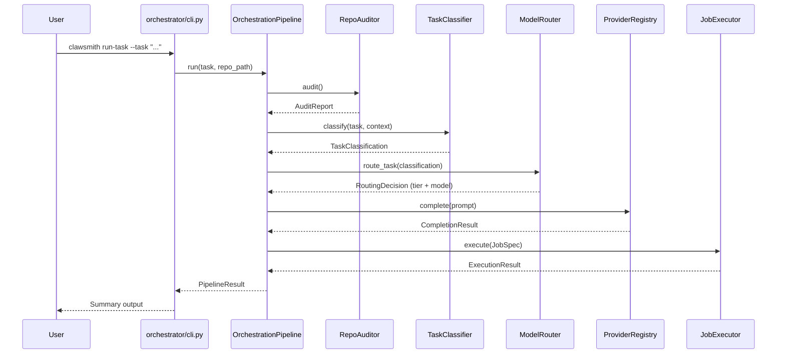

# ClawSmith

## What Is ClawSmith

ClawSmith is a **local-first AI orchestration system** that audits a repository, classifies task complexity, routes to the cheapest capable model tier (local Ollama or cloud API), generates structured prompts, and executes work through controlled `.bat` job scripts. Every stage is exposed as an MCP tool for seamless integration with editors like Cursor.

## Who It's For

- **Solo developers** who want AI-assisted code tasks without sending all context to a premium API.
- **Teams** wanting cost-controlled model routing — simple tasks stay local, complex tasks escalate to cloud.
- **Cursor users** wanting MCP-integrated orchestration that plugs directly into their editor.
- **Open-source contributors** building on a modular orchestration base with swappable providers and profiles.

---

## Quick Start

```bash
# 1. Install (creates venv, installs deps, copies .env.example)
git clone https://github.com/<your-org>/Clawsmith.git
cd Clawsmith
scripts\windows\install.bat

# 2. Verify your setup
scripts\windows\doctor.bat

# 3. Start the MCP server
scripts\windows\run_mcp.bat
```

---

## Project Structure

```
Clawsmith/
├── config/                 # settings.yaml + agent profile YAMLs
│   ├── agent_profiles/     # Bundled agent profiles (5 YAML files)
│   ├── config_loader.py    # Loads settings, applies env overrides
│   └── settings.yaml       # Central configuration
├── docs/                   # Extended documentation
├── jobs/                   # Job generation and execution
│   ├── allowlist.py        # Command allowlist for safety
│   ├── bat_generator.py    # Produces .bat scripts from a JobSpec
│   ├── executor.py         # Runs .bat jobs with timeout + artifacts
│   ├── examples/           # Sample JobSpec JSON files
│   ├── generated/          # Output directory for rendered .bat files
│   ├── profile_loader.py   # Loads YAML profiles → AgentProfile → JobSpec
│   ├── schema_validator.py # Safety + correctness validation
│   ├── template_renderer.py# Renders .bat.template files with variables
│   └── templates/          # .bat.template files (5 bundled)
├── mcp_server/             # MCP SSE server exposing all tools
├── orchestrator/           # Pipeline, CLI, schemas, doctor
│   ├── cli.py              # Click entry-points (run-task, audit, etc.)
│   ├── doctor.py           # Preflight environment checker
│   ├── pipeline.py         # End-to-end orchestration
│   └── schemas.py          # Pydantic data models
├── prompts/                # Prompt generation utilities
├── providers/              # LiteLLM provider abstraction + OpenClaw adapter
├── routing/                # Task classification + model routing
│   ├── classifier.py       # Keyword-based complexity scoring
│   └── router.py           # Maps classification → model tier
├── scripts/windows/        # Windows .bat helper scripts
├── tests/                  # pytest test suite
├── tools/                  # Repo auditor, mapper, build detector, context packer
├── .env.example            # Environment variable template
├── pyproject.toml          # Project metadata + tool config
└── README.md
```

---

## Example Commands

```bash
# Install and verify
scripts\windows\install.bat
scripts\windows\doctor.bat

# Start the MCP server
scripts\windows\run_mcp.bat

# Run the full orchestration pipeline
clawsmith run-task --task "Fix the login bug in auth.py" --repo-path .

# Dry-run (no provider call, no execution)
clawsmith run-task --task "Refactor the database layer" --repo-path . --dry-run

# Audit a repository
clawsmith audit --repo-path .

# Execute a job from a JSON spec
clawsmith run-job --job-file jobs/examples/sample_task.json

# Run via Windows helper script (forwards all args to clawsmith run-task)
scripts\windows\run_orchestrator.bat --task "Fix the login bug" --repo-path "."

# Generate an OpenClaw SKILL.md registration artifact
clawsmith register-skill

# Switch models: edit config/settings.yaml → models.premium.model_name
# e.g. change from openai/gpt-4o to anthropic/claude-3-opus
```

---

## Architecture



| Component | File | Responsibility |
|---|---|---|
| CLI | `orchestrator/cli.py` | Click entry-points (`run-task`, `audit`, `run-job`, `start-server`, `register-skill`) |
| Pipeline | `orchestrator/pipeline.py` | End-to-end orchestration of all stages |
| RepoAuditor | `tools/repo_auditor.py` | Detects languages, frameworks, CI, linters, markers |
| RepoMapper | `tools/repo_mapper.py` | Builds a directory tree + detects entrypoints |
| BuildDetector | `tools/build_detector.py` | Infers build/test/lint commands from config files |
| ContextPacker | `tools/context_packer.py` | Assembles a token-budgeted context packet |
| TaskClassifier | `routing/classifier.py` | Scores complexity, ambiguity, severity, architectural impact |
| ModelRouter | `routing/router.py` | Maps classification to a model tier |
| ProviderRegistry | `providers/registry.py` | Resolves tier → LiteLLM provider |
| BatGenerator | `jobs/bat_generator.py` | Produces `.bat` scripts from a `JobSpec` |
| JobSpecValidator | `jobs/schema_validator.py` | Safety + correctness checks before execution |
| JobExecutor | `jobs/executor.py` | Runs `.bat` jobs with timeout and artifact capture |
| MCP Server | `mcp_server/server.py` | Exposes all tools over SSE for editor integration |

---

## Prerequisites

- **Python 3.11+**
- **git**
- **Ollama** (optional, for local model tiers — `ollama/mistral`, `ollama/codellama`)
- **Cursor CLI** (optional, for editor integration)

---

## Environment Variables

All variables are defined in `.env.example`. Copy it to `.env` and fill in the relevant keys.

| Variable | Purpose | Default |
|---|---|---|
| `OPENAI_API_KEY` | OpenAI API key for premium / prompt polisher tiers | _(empty)_ |
| `ANTHROPIC_API_KEY` | Anthropic API key (alternative provider) | _(empty)_ |
| `OPENROUTER_API_KEY` | OpenRouter API key (alternative provider) | _(empty)_ |
| `CURSOR_CLI_PATH` | Absolute path to the Cursor CLI executable | auto-detect |
| `CLAWSMITH_CONFIG_PATH` | Path to a custom `settings.yaml` | `config/settings.yaml` |
| `LOG_LEVEL` | Logging verbosity (`DEBUG`, `INFO`, `WARNING`, `ERROR`) | `INFO` |
| `CLAWSMITH_MCP_SERVER__PORT` | Override MCP server port | `8765` |
| `OPENCLAW_WEBHOOK_SECRET` | HMAC secret for OpenClaw webhook auth (future) | _(empty)_ |

Config overrides use `CLAWSMITH_<SECTION>__<KEY>` with double-underscore nesting:

```
CLAWSMITH_ROUTING__LOW_COMPLEXITY_THRESHOLD=0.5
CLAWSMITH_MODELS__PREMIUM__MAX_TOKENS=16384
CLAWSMITH_EXECUTION__ALLOWED_COMMANDS=["cursor","python","git"]
```

---

## Configuration

`config/settings.yaml` is the central configuration file with these sections:

| Section | Purpose |
|---|---|
| `models` | Defines four model tiers: `local_router`, `local_code`, `premium`, `prompt_polisher`. Each has `provider`, `model_name`, `max_tokens`, `temperature`, and optional cost fields. |
| `routing` | Thresholds for the model router: `low_complexity_threshold` (below = local_router), `high_complexity_threshold` (above = premium), `ambiguity_bump_threshold`. |
| `execution` | `default_timeout`, `max_retries`, `artifacts_dir`, `logs_dir`, and `allowed_commands` allowlist. |
| `mcp_server` | `host`, `port`, `transport` for the MCP SSE server. |
| `openclaw` | `skill_name`, `mcp_endpoint`, `webhook_secret` for OpenClaw integration. |

---

## Model Routing

The router maps task complexity to one of three execution tiers:

```
complexity < 0.35  ──►  local_router  (ollama/mistral — fast, cheap)
0.35 ≤ complexity < 0.70  ──►  local_code  (ollama/codellama — code-focused)
complexity ≥ 0.70  ──►  premium  (openai/gpt-4o — highest capability)
```

Additional rules:
- **Ambiguity bump**: If `ambiguity_score > ambiguity_bump_threshold`, the tier is bumped up one level.
- **Severity override**: If `failure_severity > 0.8`, the tier is overridden to `premium` regardless of complexity.
- **Confidence**: `confidence_score = 1.0 - ambiguity_score`.

---

## Running the Orchestrator

### Full pipeline

```bash
clawsmith run-task --task "Fix the login bug in auth.py" --repo-path .
clawsmith run-task --task "Refactor the database layer" --repo-path . --dry-run
```

### Audit a repository

```bash
clawsmith audit --repo-path .
```

### Execute a job from a JSON spec

```bash
clawsmith run-job --job-file jobs/examples/sample_task.json
```

Or via the Windows scripts:

```bash
scripts\windows\run_orchestrator.bat --task "Fix the login bug" --repo-path "."
```

---

## MCP Server

The MCP server exposes all ClawSmith tools over SSE so editors like Cursor can invoke them.

### Start

```bash
scripts\windows\run_mcp.bat
# or
clawsmith start-server
```

The server listens on `127.0.0.1:8765` by default (configurable in `settings.yaml` or via `CLAWSMITH_MCP_SERVER__PORT`).

### Exposed tools

All tools registered in `mcp_server/server.py` — including audit, classify, route, generate prompt, execute job, and more.

### Connect from Cursor

Add the SSE endpoint (`http://127.0.0.1:8765/sse`) in Cursor's MCP settings.

---

## `.bat` Job System

Jobs flow through a controlled pipeline:

1. A `JobSpec` (Pydantic model) is created describing the task, commands, timeout, and working directory.
2. `JobSpecValidator` checks safety: command allowlist, shell metacharacter rejection, path traversal prevention, timeout bounds.
3. `BatGenerator` produces a `.bat` script with build commands, test commands, timeout checking, and log redirection.
4. `JobExecutor` runs the `.bat` file, captures stdout/stderr to `artifacts/<job_id>/`, and returns an `ExecutionResult`.

Generated scripts and metadata live in `jobs/generated/` and `artifacts/<job_id>/`.

---

## Switching Providers / Models

Edit the `models` section in `config/settings.yaml`. Model names use [LiteLLM](https://docs.litellm.ai/) format:

```yaml
models:
  premium:
    provider: anthropic
    model_name: anthropic/claude-3-opus
    max_tokens: 8192
    temperature: 0.2
```

Supported providers include `ollama`, `openai`, `anthropic`, `openrouter`, and any LiteLLM-compatible provider.

---

## OpenClaw Integration

ClawSmith can register itself as an **OpenClaw skill**. See [docs/openclaw_integration.md](docs/openclaw_integration.md) for the full setup guide, including:

- Running `clawsmith register-skill` to generate `SKILL.md`
- Required environment variables
- `config/openclaw_skill.yaml` format
- Webhook integration roadmap

---

## Documentation

- [Installation Guide](INSTALL.md)
- [Contributing](CONTRIBUTING.md)
- [Architecture](docs/architecture.md)
- [Agent Profiles](docs/agent_profiles.md)
- [`.bat` Templates](docs/bat_templates.md)
- [Troubleshooting](docs/troubleshooting.md)
- [OpenClaw Integration](docs/openclaw_integration.md)

---

## Known Limitations

- **Cursor CLI integration** requires manual path configuration (`CURSOR_CLI_PATH` env var) if Cursor is not on `PATH`.
- **Local models** require Ollama running separately (`ollama serve`).
- **Windows-only `.bat` execution** — the job system generates Windows batch scripts. Cross-platform shell support is planned.
- **No live OpenClaw credentials** are available in the development environment; the adapter is implemented but the webhook receiver is not yet wired to an HTTP server.
